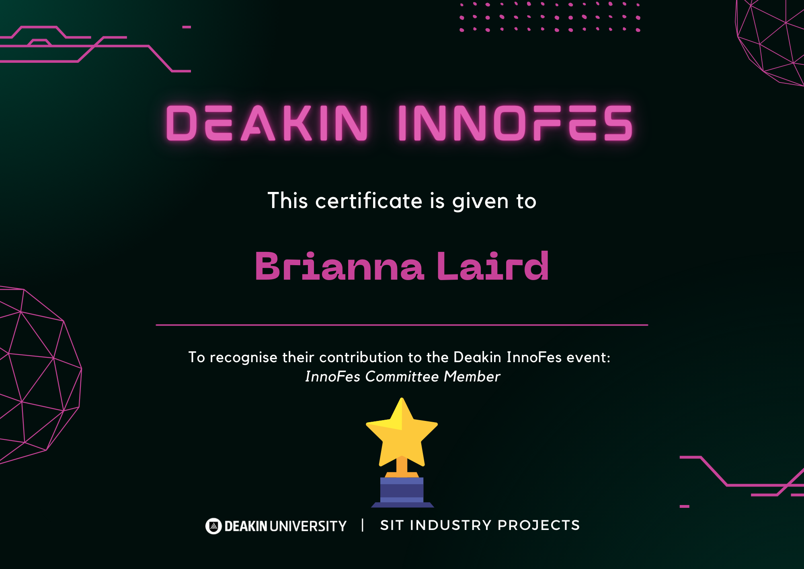

# Capstone Subjects

Throughout my capstone subjects, I had the privilege of working within the [Thoth Tech](https://github.com/thoth-tech) company, contributing to the development and expansion of the [SplashKit](https://github.com/splashkit) library. These projects allowed me to apply my skills in both leadership and technical development, while collaborating with a talented team to deliver high-quality resources for the SplashKit community.

## Capstone A

In **Capstone A**, I took on a leadership role within Thoth Tech, where I led the tutorials team for SplashKit. My contributions and dedication were recognised with a perfect grade of 100. Additionally, I served as the Innofes Committee member for Thoth Tech, where I was responsible for organising the team’s participation in the Innofes event. This role involved creating promotional materials, organising team logistics, preparing pitches, and effectively communicating essential information to ensure a successful event.

My primary contributions in Capstone A included:

- **Tutorial Expansion**: I led a comprehensive update of all SplashKit tutorials, adding support for C#, C++, and Python. I also initiated and managed the development of both top-level and OOP tutorials for C#.
- **Core Development**: I contributed to the SplashKit core by developing new functions, enhancing the library’s capabilities for users.
- **Documentation Overhaul**: I updated READMEs across 16 repositories, ensuring they reflected new and revised content. I added image shields displaying key information such as contributors, pull requests, stars, and forks, all linked for easy access to relevant details.
- **Extensive Documentation**: I created detailed documentation for the tutorials team, as well as content for the [SplashKit website](https://splashkit.io/) and the usage example expansion, supporting the community in better understanding and utilizing SplashKit.

## Capstone B

In **Capstone B**, I am focusing on more technical contributions, delving deeper into the SplashKit core. I am also continuing to oversee work on tutorials and the expansion of usage examples. In addition, I am working on the creation of the Beyond Splashkit project, where we take programming outside of the concepts in Splashkit and into the real world.

For more information, visit:

- [Thoth Tech GitHub](https://github.com/thoth-tech)
- [Thoth Tech Website](https://thoth-tech.netlify.app/)
- [SplashKit GitHub](https://github.com/splashkit)
- [SplashKit Website](https://splashkit.io/)

## Repository Contributions

During my time at Thoth Tech, I have contributed to a number of repositories. Here are some of the projects I have worked on:

  

    
  

  

    
  

  

    
  

  

    
  

  

    
  

  

    
  

  

    
  

  

    
  

  

    
  

  

    
  

  

    
  

