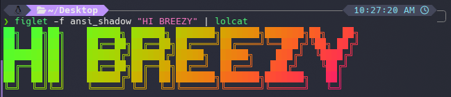

# Using Figlet and Lolcat for Eye-Catching Terminal Messages

This guide will help you set up Figlet and Lolcat on Linux to create colourful, ASCII-styled terminal messages. I've provide detailed instructions for both Ubuntu and Arch-based systems.

---

## **Step 1: Install Figlet**

Figlet is a tool for generating ASCII art from text. Use the appropriate commands based on your Linux distribution:

### **For Arch-based Systems (e.g., Arch, Manjaro):**

```bash
sudo pacman -S figlet
```

Then do -

```bash
yay -S figlet-fonts
```

### **For Ubuntu-based Systems (e.g., Ubuntu, Debian):**

```bash
sudo apt update
sudo apt install figlet figlet-data
```

---

## **Step 2: Install Lolcat**

Lolcat adds vibrant rainbow colours to your terminal output, making your Figlet creations even more eye-catching.

### **For Arch-based Systems:**

```bash
sudo pacman -S lolcat
```

### **For Ubuntu-based Systems:**

```bash
sudo apt install lolcat
```

---

## **Step 4: Verify the Installation**

Ensure everything is set up correctly:

1. **List Available Fonts:**

   ```bash
   figlist
   ```

   This command will display all of the available figlet font files on your system.

2. **Output all fonts to a txt file:**

    To preview all of the available fonts, you can output them to a text file by running the following commands:

   ```bash
   cd ~/Desktop
   showfigfonts > figlet_fonts.txt
   ```

   This command will save the list of available figlet fonts to a text file named `figlet_fonts.txt`.
   Outputting to a txt file is a handy way to be able to preview **all** of the fonts available to you as there is a lot of them and your terminal may not be able to display them all at once.
   I've also added the output as a page if you'd like to view it [all figlet fonts](content/blog-posts/2025-01-17-using-figlet-and-lolcat.md)

3. **Test Figlet Output:**

   Run the following to test Figlet:

   ```bash
   figlet -f slant "Success"
   ```

4. **Combine Figlet with Lolcat:**

   Add some colour to your output:

   ```bash
   figlet -f slant "Success" | lolcat
   ```

   You should see a colourful ASCII-styled message in your terminal.

    

---

## **Example Usage**

Here are some examples to try:

1. **Custom Welcome Message:**

   ```bash
   figlet -f big "Welcome" | lolcat
   ```

   

2. **Dynamic Output:**

   Combine Figlet and Lolcat with other commands:

   ```bash
   echo "Hello, $(whoami)!" | figlet | lolcat
   ```

    

## Trying Out Figlet and Lolcat together

Now that you have Figlet working, let’s enhance it with Lolcat’s colourful output.

1. **Basic Test**:  

   ```bash
   figlet -f ansi_shadow "HI BREEZY" | lolcat
   ```

   This will display a vibrant, rainbow-colored message.

   

2. **Lolcat Options Explained**:  
   Lolcat comes with a variety of options to customise the colour output:

   - **`-a` (Animation)**:  
     Enables animated colouring that cycles through colours over time.  
     Example:  

     ```bash
     figlet -f ansi_shadow "HI BREEZY" | lolcat -a
     ```

     

   - **`-d` (Delay)**:  
     Sets the delay in milliseconds for animated frames when `-a` is enabled.  
     Example:  

     ```bash
     figlet -f ansi_shadow "HI BREEZY" | lolcat -a -d 5
     ```

    

   - **`-F` (Frequency)**:  
     Adjusts the rainbow frequency. Lower values create smoother gradients.  
     Examples:
  
     ```bash
     figlet -f ansi_shadow "HI BREEZY" | lolcat -F 0.3
     ```

     ```bash
     figlet -f ansi_shadow "HI BREEZY" | lolcat -F 0.5
     ```

     ```bash
     figlet -f ansi_shadow "HI BREEZY" | lolcat -F 0.7
     ```

     

   - **Without Options**:  
     By default, `lolcat` applies a static rainbow gradient.  
     Example:  

     ```bash
     figlet -f ansi_shadow "HI BREEZY" | lolcat
     ```

     

3. **Creative Uses**:  
   - **Rainbow String**:  

     ```bash
     echo "Hello, Breezy!" | lolcat
     ```

   - **Animate Directory Listing**:  

     ```bash
     ls -la | lolcat -a -d 10
     ```

   - **Rainbow File Output**:  

     ```bash
     cat yourfile.txt | lolcat -a -d 3
     ```

---

## Customising Your Terminal

### **Using Figlet and Lolcat**

Decide on the text you'd like to display, whether to use Lolcat, and which fonts and styles suit your preferences. For example, I chose the `ANSI Shadow` font and custom colours for my terminal setup. Here's how you can add your own customisation:

1. Open your terminal configuration file (e.g., `.zshrc` or `.bashrc`).
2. Add the following line at the very beginning to display your message every time you open the terminal:

   (can change the message, font and lolcat options to whatever you'd like)

   ```bash
   figlet -f ansi_shadow "HI BREEZY" | lolcat -F 0.3
   ```

3. Save the file and restart your terminal to see the magic in action.

Here’s an example of how it looks when I first open my terminal:

 
---

### **Using Figlet with Custom Colours**

For a more personalised touch, you can use ANSI colour codes to apply specific colours to your Figlet output. Here’s how to preview and customise your terminal message with your favorite colours:

1. **Run the Following Script**:  
   This script uses a set of predefined ANSI colours to apply vibrant hues to Figlet text, cycling through them line by line:

   ```bash
    # Define colors
    colors=(
    "\033[38;5;171m"
    "\033[38;5;135m"
    "\033[38;5;175m"
    "\033[38;5;141m"
    "\033[38;5;212m"
    )

    # Generate Figlet text with ANSI Shadow font
    figlet_text=$(figlet -f ansi_shadow "HI BREEZY")

    # Split the Figlet text into lines (zsh-compatible)
    lines=("${(f)figlet_text}")

    # Apply colors to each line and print
    for i in {1..${#lines[@]}}; do
    color=${colors[$(( (i - 1) % ${#colors[@]} + 1 ))]}  # Cycle through colors
    echo -e "${color}${lines[i-1]}\033[0m"  # Reset color at the end
    done
   ```

   Here's how the output will look:
   

2. **Customise It**:  
   - Replace `ansi_shadow` with your preferred Figlet font.
   - Change the colours by updating the ANSI codes in the `colours` array. Use the colour chart below to pick your favorite shades.

3. **Preview Colours**:  
   Here’s an ANSI colour chart to help you choose:
   

4. **Enjoy Your Setup**:  
   Save the script to a file or add it to your shell configuration to make your terminal display colourful, personalised messages every time it starts.
