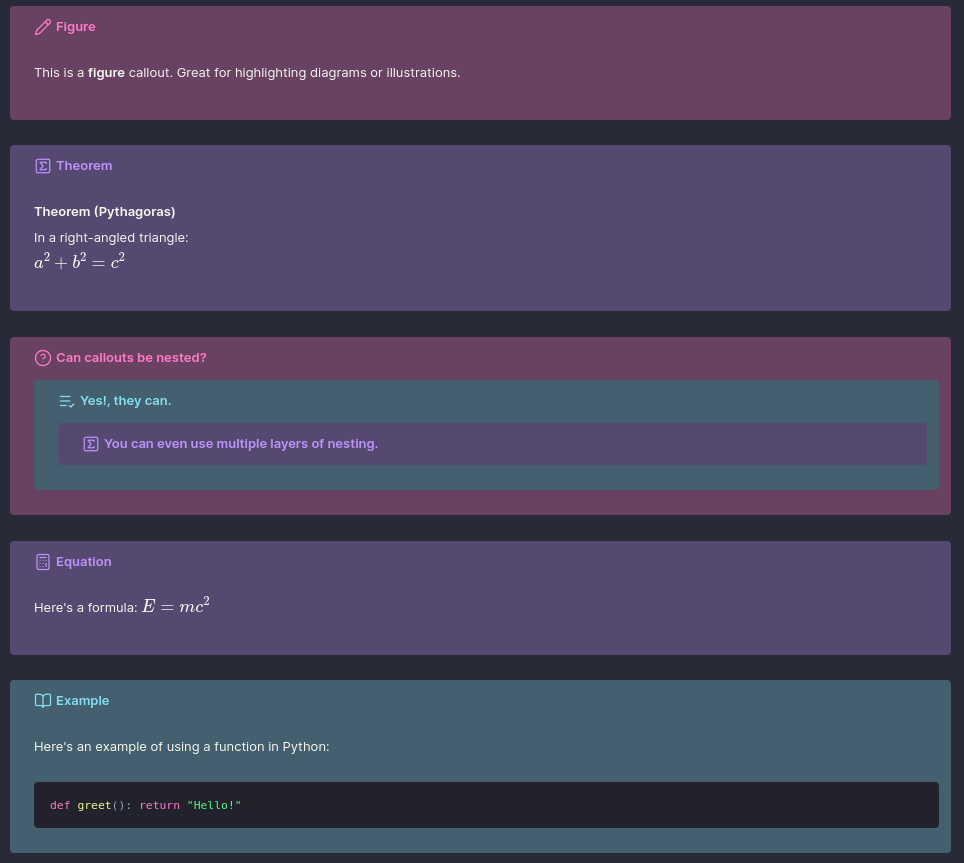
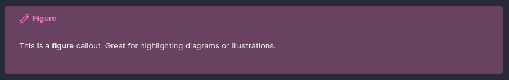
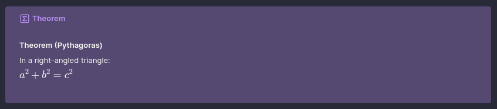
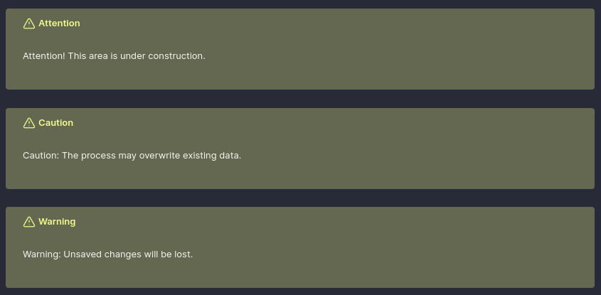
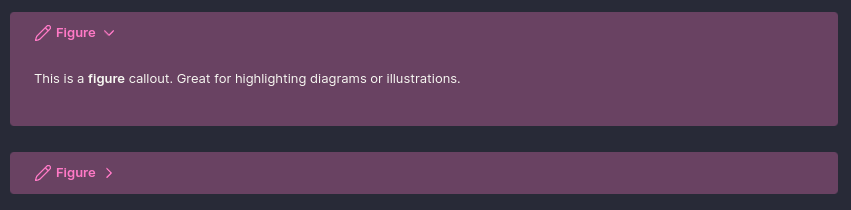
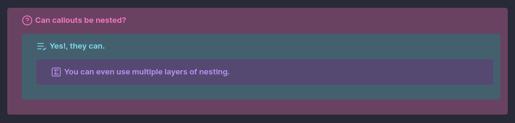

# How to make Custom Callouts in Obsidian

After spending some time experimenting with different ways to style my notes, I realized I wanted custom callouts in Obsidian, but without adding yet another plugin. I’m trying to keep my setup lean and avoid relying on too many plugins for core features. This guide is the result of my process figuring out how to create my own custom callouts using just CSS, so you can do the same!

Callouts are a powerful way to visually style notes in [Obsidian](https://obsidian.md), especially when organising research, study notes, to-do lists, or even documenting your projects. While Obsidian comes with built-in callout styles like `> [!note]`, you can easily create your own custom callouts with a bit of CSS.



This post will walk you through how to make your own **custom callout blocks** in Obsidian.


## Table of Contents

- [How to make Custom Callouts in Obsidian](#how-to-make-custom-callouts-in-obsidian)
  - [Table of Contents](#table-of-contents)
  - [Steps Overview](#steps-overview)
    - [Step 1: Enable Custom CSS Snippets](#step-1-enable-custom-css-snippets)
    - [Step 2: Define a Custom Callout Block in the css file](#step-2-define-a-custom-callout-block-in-the-css-file)
    - [Step 3: Customise Labels, Icons \& Colours](#step-3-customise-labels-icons--colours)
    - [Step 4: Using Theme Variables for Consistent Colours](#step-4-using-theme-variables-for-consistent-colours)
  - [Helpful Tips](#helpful-tips)
    - [Foldable Callouts](#foldable-callouts)
    - [Blank Callout](#blank-callout)
    - [Creating a Colour Overlay on a Dark Base](#creating-a-colour-overlay-on-a-dark-base)
    - [Nesting Callouts](#nesting-callouts)
    - [Scrollable Callouts](#scrollable-callouts)
      - [How to preserve styling for scrollable callouts](#how-to-preserve-styling-for-scrollable-callouts)
  - [My Exact CSS File](#my-exact-css-file)
  - [Final Tips](#final-tips)

---

## Steps Overview

The following steps will guide you through creating custom callouts in Obsidian:

### Step 1: Enable Custom CSS Snippets

Before we begin, make sure you’ve enabled CSS snippets in Obsidian:

1. Open **Settings** → **Appearance**
2. Scroll down to **CSS snippets**
3. Click **Open snippets folder**
4. Create a new `.css` file, for example: `custom-callouts.css`
5. Back in Obsidian, toggle your new snippet **on**

---

### Step 2: Define a Custom Callout Block in the css file

Here’s an example of a custom callout called `figure` with a pink theme and a pencil icon:

```css
/* === FIGURE === */
.callout[data-callout="figure"] {
    --callout-color: 255, 121, 198;
    --callout-icon: lucide-pencil;
    background-color: rgba(255, 121, 198, 0.2);
}
```

To use this in your note, write:

```markdown
> [!figure]
> This is a **figure** callout. Great for highlighting diagrams or illustrations.
```

This is how it looks in Obsidian:



And voilà, Obsidian will render it with your defined styles.

---

### Step 3: Customise Labels, Icons & Colours

You can define any name for your callout, it can be `[!theorem]`, `[!tip]`, `[!poetry]`, or whatever suits your workflow. Each one can be styled uniquely by modifying:

* `--callout-color`: the RGB value of your theme
* `--callout-icon`: choose any [Lucide Icon](https://lucide.dev/) (used by Obsidian)

Here's another example using a theorem block:

```css
/* === THEOREM === */
.callout[data-callout="theorem"] {
    --callout-color: 189, 147, 249;
    --callout-icon: lucide-square-sigma;
    background-color: rgba(189, 147, 249, 0.2);
}
```

Use it in your note like this:

```markdown
> [!theorem]
> **Theorem (Pythagoras)**  
> In a right-angled triangle:  
> $a^2 + b^2 = c^2$
```

This will render as:



Most of the ones I've made have been for equations, theorems, figures or other mathematical content, but you can create any type of callout you need. I even made some "warning" ones:

```css
/* === ATTENTION, CAUTION, WARNING === */
.callout[data-callout="attention"],
.callout[data-callout="caution"],
.callout[data-callout="warning"] {
    --callout-color: 241, 250, 140;
    --callout-icon: lucide-alert-triangle;
    background-color: rgba(241, 250, 140, 0.2);
}
```

Use them like this:

```markdown

> [!attention]
> Attention! This area is under construction.

> [!caution]
> Caution: The process may overwrite existing data.

> [!warning]
> Warning: Unsaved changes will be lost.
```

This will render as:



---

### Step 4: Using Theme Variables for Consistent Colours

If you want to keep your callout colours consistent with your Obsidian theme, or you just want an easy way to update your colour scheme in one place, you can define custom colour variables using the `:root` selector at the top of your CSS file.

Here’s an example using a Dracula-inspired palette:

```css
:root {
    /* Dracula base palette */
    --drac-bg: #282A37;
    --drac-pink-rgb: 255, 121, 198;
    --drac-cyan-rgb: 132, 222, 240;
    --drac-purple-rgb: 189, 147, 249;
    --drac-green-rgb: 80, 250, 123;
    --drac-yellow-rgb: 241, 250, 140;
    --drac-red-rgb: 255, 85, 85;
}
```

Then, reference these variables when creating your callouts:

```css
/* === QUESTION === */
.callout[data-callout="question"] {
    --callout-color: var(--drac-pink-rgb);
    --callout-icon: lucide-help-circle;
    background-color: rgba(var(--drac-pink-rgb), 0.2);
}
```

This approach keeps your CSS more readable and maintainable, and allows you to easily **change the colour scheme for all your callouts at once** by editing the `:root` variables.

For example, your `theorem` callout could use the purple variable:

```css
/* === THEOREM === */
.callout[data-callout="theorem"] {
    --callout-color: var(--drac-purple-rgb);
    --callout-icon: lucide-square-sigma;
    background-color: rgba(var(--drac-purple-rgb), 0.2);
}
```

And your `warning` set could use:

```css
/* === WARNING === */
.callout[data-callout="warning"] {
    --callout-color: var(--drac-yellow-rgb);
    --callout-icon: lucide-alert-triangle;
    background-color: rgba(var(--drac-yellow-rgb), 0.2);
}
```

## Helpful Tips

### Foldable Callouts

You can make callouts foldable by adding `+` or `-` after the label:

* `+` → Open by default, but collapsible
* `-` → Closed by default

```markdown
> [!figure]+
> This is a **figure** callout. Great for highlighting diagrams or illustrations.

> [!figure]-
> This one starts **closed** by default.
```

This works on both built-in and custom callouts.



### Blank Callout

I added a blank (neutral) callout style that lets you group a section of text into a block without adding any special styling or title. This is helpful when you want to link to an entire section of text from other notes, using the neutral callout makes it easy to reference the whole block, while keeping the visual style minimal.

```css
/* === NEUTRAL (unstyled, no title, no icon, no styling) === */
.callout[data-callout="neutral"] {
    --callout-color: 255, 255, 255;
    --callout-icon: none;
    background-color: unset !important;
    box-shadow: none !important;
    border: none !important;
    padding: 0 !important;
    margin: 0 !important;
}

.callout[data-callout="neutral"]::before {
    display: none !important;
}

/* Hide the title bar completely */
.callout[data-callout="neutral"] .callout-title {
    display: none !important;
}
```

This allows you to create a clean, unstyled block that can be used for grouping content without any additional visual noise. It also hides the title bar and icon, making it truly neutral.

---

### Creating a Colour Overlay on a Dark Base

If you're using a dark theme and want each callout to sit on a consistent dark base while still showing its colour clearly, you can use an **overlay effect** like this (add it into the same CSS file):

```css
/* Base background for all callouts */
.callout {
    background-color: #282A37 !important; /* Base background */
    position: relative;
    overflow: hidden;
}

/* Overlay using callout color with opacity */
.callout::before {
    content: "";
    position: absolute;
    inset: 0;
    background-color: rgb(var(--callout-color), 0.3); /* Top color overlay */
    pointer-events: none;
    z-index: 0;
    border-radius: var(--radius-s);
}

/* Ensure content stays above the overlay */
.callout > * {
    position: relative;
    z-index: 1;
}
```

This ensures each callout has a consistent dark base, while the `--callout-color` overlays with controlled transparency. Here the base background colour is the default colour of my Obsidian theme, but you can change it to whatever suits your theme.

This is especially helpful when **nesting** callouts (see below), as it prevents the background of one from bleeding into another.

---

### Nesting Callouts

Yes, you **can nest callouts**, and they’ll render beautifully, especially if you use the background layering technique above.

```markdown
> [!question] Can callouts be nested?
> > [!todo] Yes, they can.
> > > [!example] You can even use multiple layers of nesting.
```

This will render as:



Each level keeps its own style, icon, and background overlay, making complex structures more readable.

### Scrollable Callouts

You can also create scrollable callouts by adding some custom CSS, this is useful for large blocks of text or code that you want to keep within a defined area without breaking the flow of your notes.

```css
/* === SHARED SCROLL BEHAVIOUR === */
.callout[data-callout$="-scrollable"] .callout-content {
    --shown-line-count: 8;
    max-height: calc(var(--line-height-normal) * 1rem * var(--shown-line-count));
    overflow-y: auto;
}
```

Here you can define a callout that will only show a certain number of lines before it becomes scrollable. This is particularly useful for keeping your notes tidy while still allowing access to larger blocks of text. Whats cool is that you can combine this with any of the custom callouts, so long as you append `-scrollable` to the callout type.

#### How to preserve styling for scrollable callouts

If you want to preserve the styling of a callout while making it scrollable, you just need to make a small adjustment to the CSS. For example, if you want to make a `note` callout scrollable, then you just need to add a `^` before the `=` in the selector:

```css
/* === NOTE === */
.callout[data-callout^="note"] {
    --callout-color: var(--drac-pink-rgb);
    --callout-icon: lucide-pencil;
    background-color: rgba(var(--drac-pink-rgb), 0.2);
}
```

Now you can use the scrollable version of the note callout like this:

```
> [!note-scrollable] Note
> This is a scrollable note callout. It will only show a limited number of lines before becoming scrollable, while also preserving the styling of a regular note callout.
```

## My Exact CSS File

Below is the complete CSS file I use for my custom callouts in Obsidian. The colour variables are defined at the top using the Dracula theme palette, but you can easily swap them out to match your own preferred colour scheme.

I use a variety of callouts to visually organise different types of content in my notes. For instance, `figure` and `equation` callouts highlight key diagrams and mathematical expressions, while `theorem` is used to frame formal results. I use `example` to walk through concepts, `todo` to track ongoing tasks, and `tip` or `important` to emphasise helpful insights. For summarising ideas, I use `abstract` and `summary`, and I reserve `bug`, `fail`, and `error` to flag issues or areas needing revision. Each callout is styled with a Dracula-inspired colour overlay to maintain visual consistency across my workspace.

```{admonition} Custom Callouts CSS
:class: note, dropdown
```css
:root {
    /* Dracula base palette*/
    --drac-bg: #282A37;
    --drac-pink-rgb: 255, 121, 198;
    --drac-cyan-rgb: 132, 222, 240;
    --drac-purple-rgb: 189, 147, 249;
    --drac-green-rgb: 80, 250, 123;
    --drac-yellow-rgb: 241, 250, 140;
    --drac-red-rgb: 255, 85, 85;
}

/* Base background for all callouts */
.callout {
    background-color: var(--drac-bg) !important;
    position: relative;
    overflow: hidden;
}

/* Overlay using callout color with opacity */
.callout::before {
    content: "";
    position: absolute;
    inset: 0;
    background-color: rgb(var(--callout-color), 0.3);
    border: 2px solid rgba(var(--callout-color), 2);
    pointer-events: none;
    z-index: 0;
    border-radius: var(--radius-s);
}

/* Ensure content stays above the overlay */
.callout > * {
    position: relative;
    z-index: 1;
}

/* === SHARED SCROLL BEHAVIOUR === */
.callout[data-callout$="-scrollable"] .callout-content {
    --shown-line-count: 8;
    max-height: calc(var(--line-height-normal) * 1rem * var(--shown-line-count));
    overflow-y: auto;
}

/* ==================================== SHARED STYLING FOR ALL CALLOUTS ==================================== */

/* === NOTE === */
.callout[data-callout^="note"] {
    --callout-color: var(--drac-pink-rgb);
    --callout-icon: lucide-pencil;
    background-color: rgba(var(--drac-pink-rgb), 0.2);
}

/* === FIGURE === */
.callout[data-callout^="figure"] {
    --callout-color: var(--drac-pink-rgb);
    --callout-icon: lucide-pencil;
    background-color: rgba(var(--drac-pink-rgb), 0.2);
}

/* === QUESTION === */
.callout[data-callout^="question"] {
    --callout-color: var(--drac-pink-rgb);
    --callout-icon: lucide-help-circle;
    background-color: rgba(var(--drac-pink-rgb), 0.2);
}

/* === TODO === */
.callout[data-callout^="todo"] {
    --callout-color: var(--drac-cyan-rgb);
    --callout-icon: lucide-list-check;
    background-color: rgba(var(--drac-cyan-rgb), 0.2);
}

/* === THEOREM === */
.callout[data-callout^="theorem"] {
    --callout-color: var(--drac-purple-rgb);
    --callout-icon: lucide-square-sigma;
    background-color: rgba(var(--drac-purple-rgb), 0.2);
}

/* === DEFINITION === */
.callout[data-callout^="definition"] {
    --callout-color: var(--drac-purple-rgb);
    --callout-icon: lucide-pencil;
    background-color: rgba(var(--drac-purple-rgb), 0.2);
}

/* === EQUATION === */
.callout[data-callout^="equation"] {
    --callout-color: var(--drac-purple-rgb);
    --callout-icon: lucide-calculator;
    background-color: rgba(var(--drac-purple-rgb), 0.2);
}

/* === EXAMPLE === */
.callout[data-callout^="example"] {
    --callout-color: var(--drac-cyan-rgb);
    --callout-icon: lucide-book-open;
    background-color: rgba(var(--drac-cyan-rgb), 0.2);
}

/* === CITE & QUOTE === */
.callout[data-callout^="cite"],
.callout[data-callout^="quote"] {
    --callout-color: var(--drac-yellow-rgb);
    --callout-icon: lucide-quote;
    background-color: rgba(var(--drac-yellow-rgb), 0.2);
}

/* === BUG === */
.callout[data-callout^="bug"] {
    --callout-color: var(--drac-red-rgb);
    --callout-icon: lucide-bug;
    background-color: rgba(var(--drac-red-rgb), 0.2);
}

/* === DANGER & ERROR === */
.callout[data-callout^="danger"],
.callout[data-callout^="error"] {
    --callout-color: var(--drac-red-rgb);
    --callout-icon: lucide-zap;
    background-color: rgba(var(--drac-red-rgb), 0.2);
}

/* === FAIL, FAILURE, MISSING === */
.callout[data-callout^="fail"],
.callout[data-callout^="failure"],
.callout[data-callout^="missing"] {
    --callout-color: var(--drac-red-rgb);
    --callout-icon: lucide-x;
    background-color: rgba(var(--drac-red-rgb), 0.2);
}

/* === CHECK, DONE, SUCCESS === */
.callout[data-callout^="check"],
.callout[data-callout^="done"],
.callout[data-callout^="success"] {
    --callout-color: var(--drac-green-rgb);
    --callout-icon: lucide-check;
    background-color: rgba(var(--drac-green-rgb), 0.2);
}

/* === ABSTRACT, SUMMARY, TLDR === */
.callout[data-callout^="abstract"],
.callout[data-callout^="summary"],
.callout[data-callout^="tldr"] {
    --callout-color: var(--drac-green-rgb);
    --callout-icon: lucide-file-text;
    background-color: rgba(var(--drac-green-rgb), 0.2);
}

/* === HINT, IMPORTANT, TIP === */
.callout[data-callout^="hint"],
.callout[data-callout^="important"],
.callout[data-callout^="tip"] {
    --callout-color: var(--drac-green-rgb);
    --callout-icon: lucide-flame;
    background-color: rgba(var(--drac-green-rgb), 0.2);
}

/* === ATTENTION, CAUTION, WARNING === */
.callout[data-callout^="attention"],
.callout[data-callout^="caution"],
.callout[data-callout^="warning"] {
    --callout-color: var(--drac-yellow-rgb);
    --callout-icon: lucide-alert-triangle;
    background-color: rgba(var(--drac-yellow-rgb), 0.2);
}

/* === FAQ, HELP === */
.callout[data-callout^="faq"],
.callout[data-callout^="help"] {
    --callout-color: var(--drac-yellow-rgb);
    --callout-icon: lucide-help-circle;
    background-color: rgba(var(--drac-yellow-rgb), 0.2);
}

/* ==================================== NEUTRAL CALLOUT SETTINGS ==================================== */

/* === NEUTRAL (unstyled, no title, no icon, no styling) === */
.callout[data-callout="neutral"] {
    --callout-color: 255, 255, 255;
    --callout-icon: none;
    background-color: unset !important;
    box-shadow: none !important;
    border: none !important;
    padding: 0 !important;
    margin: 0 !important;
}

.callout[data-callout="neutral"]::before {
    display: none !important;
}

/* Hide the title bar completely */
.callout[data-callout="neutral"] .callout-title {
    display: none !important;
}
```
```

## Final Tips

* Define custom callout names that suit your workflow, like `note`, `figure`, `equation`, `bug`, or `reminder`.
* Use `:root` variables to keep your colors consistent across different callouts and future-proof your CSS.
* Match your callouts to your Obsidian theme for a more cohesive visual experience.
* Use icons from [Lucide](https://lucide.dev/) to make each callout instantly recognizable.
* Experiment with different background opacities to find the right balance for readability.
* Consider using foldable callouts to keep your notes tidy and focused.

